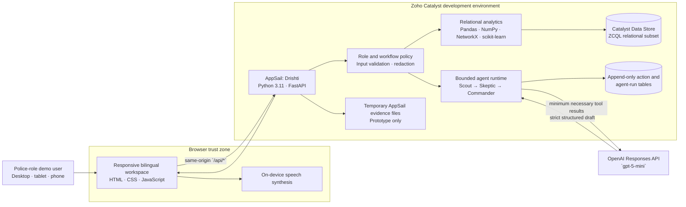
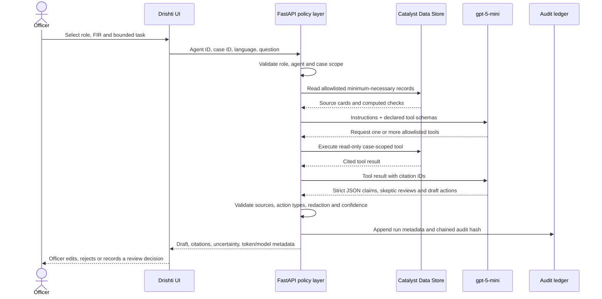
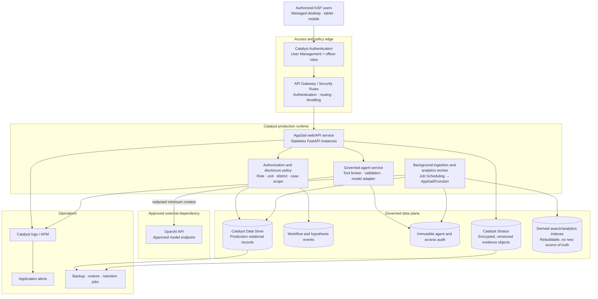
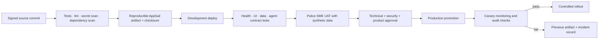

# Drishti submission architecture and production deployment plan

## 1. Executive summary

Drishti is a bilingual, role-aware police decision-support workspace for turning fragmented FIR records into source-linked investigation briefs, review queues, evidence checks, and accountable human decisions.

The deployed prototype proves four things:

1. Relational FIR data can be converted into operationally useful views for five police roles.
2. Sixteen bounded AI agents can use a small set of read-only tools to prepare cited drafts without executing police action.
3. Every model result can expose its sources, uncertainty, reviewer challenge, model metadata, and tamper-evident audit hash.
4. The application can run end-to-end on Zoho Catalyst AppSail and Catalyst Data Store with `gpt-5-mini` as the configured model.

The production design preserves that workflow while replacing prototype role simulation, temporary evidence storage, and synchronous heavy work with authenticated identity, server-enforced authorization, versioned object storage, background jobs, monitoring, and controlled releases.

## 2. Problem being solved

Police officers often work across multiple FIR, accused, victim, evidence, court, arrest, and chargesheet records. The operational problem is not merely search. It is deciding:

- what needs attention now;
- which record supports each finding;
- which evidence or procedural field is missing;
- whether a suggested cross-case link is only a lead or independently supported;
- who must review the next action; and
- what changed after an AI review.

Drishti is designed as an accountable decision-support layer over the system of record. It does not replace the investigating officer, approve legal or operational actions, determine guilt, contact a person, or dispatch personnel.

## 3. Users and operational surfaces

| Role | Primary need | Drishti surface |
| --- | --- | --- |
| State Command / DGP | Statewide oversight, cross-district risk and audit visibility | Command dashboard, trends, review outcomes, coordination drafts |
| District Command / SP | District supervision and human approval queues | Supervisor command centre, weak links, overdue work, agent audits |
| Station Officer | FIR intake, investigation steps, evidence gaps and handoff | Today workspace, case commander, FIR/evidence workflows |
| Patrol Supervisor | Minimum-necessary location and shift priorities | Patrol shift briefing with no unnecessary case narrative or identity data |
| Crime Analyst | Explainable patterns, candidate links and data quality | Network, pattern, reconstruction and hypothesis workspaces |

The interface supports English and Kannada, desktop/tablet/mobile layouts, plain operational labels, touch-sized controls, visible record status, and browser-native voice narration.

## 4. Deployed prototype architecture

### Current deployed components

| Layer | Implementation |
| --- | --- |
| Presentation | Responsive vanilla HTML/CSS/JavaScript; English/Kannada; accessible navigation; role-specific workspaces |
| Voice | Browser `speechSynthesis`; no audio is sent to a speech provider and no speech token is consumed |
| Application | FastAPI service served from Catalyst AppSail on the Catalyst-provided listen port |
| Data access | `zcatalyst-sdk` and ZCQL; deployed configuration requires Catalyst Data Store |
| Analytics | Pandas, NumPy, SciPy, scikit-learn and NetworkX for aggregation, similarity, forecasting and graph views |
| Agent model | OpenAI Responses API using `gpt-5-mini` |
| Agent controls | Role allowlists, five read-only tools, strict JSON schema, output validation, PII masking, cited claims, human-only drafts |
| Audit | `DrishtiAgentRun` hash chain and append-only `DrishtiOperationalAction` events |
| Reports | Server-generated PDF case briefs using ReportLab |
| Demo data | Synthetic development subset: 2,000 FIRs plus related master and transaction tables; fixed edge-case scenarios |
| Runtime fallback | If the live model is unavailable or fails evidence validation, the prototype returns a clearly labelled deterministic, source-linked workflow rather than presenting model output as successful |

### Live prototype

- App: <https://drishti-50044068191.development.catalystappsail.in/>
- Latest documented feature deployment: `50733000000194005`
- Health check: `/api/health`
- Runtime: Catalyst-managed Python 3.11, 1,024 MB
- Data source: Catalyst Data Store
- AI mode: `required`
- Model: `gpt-5-mini`

## 5. Agent architecture

### Agent catalog

Drishti has 16 purpose-specific agents. Each agent declares its roles, required case scope, allowed tools, safe draft actions, bilingual description, and operating boundary.

| Group | Agents |
| --- | --- |
| Shift | Shift Briefing, Patrol Shift Briefing |
| Investigation | Case Triage, Evidence Gap, Timeline Reconstruction, Linked Case Verification, Statement Consistency, Investigation Planning |
| Supervision | Supervisor Review, District Coordination |
| Station work | FIR Drafting, Legal Procedure, Evidence Intake, Victim Follow-up |
| Governance/completion | Data Quality, Court Readiness |

### Five read-only agent tools

| Tool | Returns | Boundary |
| --- | --- | --- |
| `shift_context` | Priority counts, pending reviews, handoffs and review triggers | Role-scoped, minimum necessary |
| `case_reconstruction` | Recorded timeline, events and missing evidence links | Selected FIR only |
| `case_brief` | Minimized extractive FIR brief | Direct identifiers masked from generated narrative |
| `case_link_review` | Candidate links and their independent supporting signals | Link is always described as a lead, never proof |
| `data_quality_review` | Completeness, chronology, duplicate, geography and integrity checks | Identifies data risk; never rewrites a source record |

The model has no arbitrary database, browser, web, shell, messaging, dispatch, approval, or record-update tool.

### Agent request sequence

### Scout–Skeptic–Commander logic

- **Scout:** retrieves the minimum approved sources and proposes candidate claims.
- **Skeptic:** challenges missing evidence, weak links, duplicate narrative, chronology and alternative explanations; confidence must reduce when support is incomplete.
- **Commander:** formats an officer-facing draft, not an operational command. It attaches sources and states the exact human decision required.

### AI safety contract

| Agent may | Agent may not |
| --- | --- |
| Read allowlisted, scoped records | Browse arbitrary data or the public web |
| Identify record gaps or contradictions | Determine guilt or credibility |
| Explain a candidate cross-FIR lead | Treat correlation as proof |
| Prepare editable checklists and review drafts | Arrest, dispatch, contact, message or surveil |
| Cite sources and express uncertainty | Approve, merge or alter an investigation |
| Log model/tool metadata | Hide the model, sources or responsible reviewer |

## 6. Data architecture

### Relational source domains

The Catalyst schema contains 29 tables grouped as follows:

- **Organisation and identity:** State, District, UnitType, Unit, Rank, Designation, Employee.
- **Case classification:** CaseCategory, GravityOffence, CrimeHead, CrimeSubHead, CaseStatusMaster.
- **Reference masters:** Court, OccupationMaster, ReligionMaster, CasteMaster, Act, Section.
- **Operational FIR data:** CaseMaster, Victim, Accused, ComplainantDetails, ActSectionAssociation, ArrestSurrender, ChargesheetDetails.
- **Drishti workflow and governance:** DrishtiHypothesisBoard, DrishtiOperationalAction, DrishtiImportJob, DrishtiAgentRun.

### Provenance rules

1. Source records retain their table and record identity.
2. Computed findings are labelled separately from recorded facts.
3. Candidate links retain their contributing signals and confidence.
4. Generated claims may cite only IDs returned by a tool.
5. Operational decisions are new append-only events; prior events are not rewritten.
6. An agent run stores query hash, plan fingerprint, previous audit hash, audit hash, tools, citation count, provider/model, response ID, token usage, status and timestamp.

## 7. Production target architecture

### Why these Catalyst services

- **Authentication/User Management:** supports managed users and roles; production requests derive identity and role server-side, never from the browser role selector. See the [official User Management documentation](https://docs.catalyst.zoho.com/en/cloud-scale/help/authentication/user-management/introduction/).
- **AppSail:** runs the Python/FastAPI application and agent service using the Catalyst-provided port and environment configuration.
- **Data Store:** remains the relational operational store, accessed with server-side Catalyst credentials and ZCQL.
- **Stratus:** stores evidence objects with object URLs, metadata and optional versioning rather than using temporary AppSail disk. See the [official Stratus documentation](https://docs.catalyst.zoho.com/en/cloud-scale/help/stratus/introduction/).
- **API Gateway:** provides a controlled API entry point with routing, authentication and throttling. See the [official API Gateway documentation](https://docs.catalyst.zoho.com/en/cloud-scale/help/api-gateway/introduction/).
- **Job Scheduling:** triggers ingestion, reconciliation, quality checks, index refresh, retention and backup tasks through job pools. See the [official Job Scheduling documentation](https://docs.catalyst.zoho.com/en/job-scheduling/).
- **DevOps Logs/APM and Application Alerts:** monitor failures, latency, model errors, job failures and security events. See the [official Application Alerts documentation](https://docs.catalyst.zoho.com/en/devops/help/application-alerts/introduction/).

Catalyst Circuits is not part of the India production proposal because the official documentation currently states that Circuits is unavailable in the IN data centre. Background orchestration therefore uses Job Scheduling with idempotent workers and persisted job state.

## 8. What the production deployment includes

### Catalyst resources

| Resource | Production configuration |
| --- | --- |
| Project environments | Separate Development, Staging/UAT and Production promotion gates |
| Authentication | Hosted/embedded or approved identity integration; named KSP accounts; role and unit mapping |
| AppSail web/API | Python 3.11 service, stateless instances, health/readiness endpoints, controlled instance sizing |
| AppSail/Function worker | Idempotent ingestion, analytics refresh, PDF jobs and scheduled governance tasks |
| API Gateway | Authenticated routes, request-size limits, per-route throttling, explicit public health route |
| Data Store | Full production schema, indexes, uniqueness constraints and workflow/audit tables |
| Stratus | Separate evidence, report and export buckets; versioning, retention and metadata policies |
| Job Scheduling | Import, reconciliation, data-quality, index refresh, backup verification and retention jobs |
| DevOps | Structured logs, correlation IDs, APM, deployment/error/model/job/security alerts |
| Secrets | `OPENAI_API_KEY` and service configuration stored only in Catalyst environment configuration |

### Application artifacts

- Versioned source commit and release tag.
- Reproducible AppSail bundle generated by `scripts/build_appsail.sh`.
- `app-config.json` with no secret values.
- `deployment/catalyst/datastore-schema.json` as the schema authority.
- API policy/routing definitions.
- Database migration and reconciliation scripts.
- Synthetic smoke-test dataset with no real police or citizen records.
- Automated unit, integration, frontend integrity and deployment smoke tests.
- Rollback package for the previous known-good release.
- Data dictionary, role matrix, incident runbook, backup/restore runbook and model-change record.

### Required environment configuration

| Variable | Production treatment |
| --- | --- |
| `OPENAI_API_KEY` | Catalyst secret; never committed, logged, displayed or placed in an archive |
| `DRISHTI_AI_MODEL` | Approved model identifier, initially `gpt-5-mini` |
| `DRISHTI_AI_MODE` | `required`; the production endpoint policy must either fail closed or enter a separately approved and visibly labelled continuity mode. The prototype currently uses the labelled deterministic continuity response |
| `DRISHTI_DATA_SOURCE` | `catalyst`; CSV fallback disabled for production |
| `DRISHTI_BOOTSTRAP_DATASTORE` | `false`; migrations run as controlled deployment jobs |
| `DRISHTI_AUTH_MODE` | Authenticated production mode |
| Log/retention settings | Environment-specific and reviewed by operations/security |

## 9. Production security and privacy controls

### Identity and authorization

- Authenticate every user through Catalyst Authentication/User Management or an approved KSP identity provider.
- Resolve role, rank, unit, district and case assignment from server-verified claims.
- Enforce authorization again inside every endpoint and every agent tool call.
- Use deny-by-default policies and separate command, district, station, patrol and analyst scopes.
- Remove the prototype role selector from production authorization decisions.
- Require re-authentication or step-up approval for sensitive reveal/export actions.

### Data minimization

- Send only fields necessary for the selected agent task.
- Mask phone, vehicle, 12-digit identity and personal-address values from generated narrative by default.
- Do not send evidence binaries to the language model.
- Store the reason, officer and scope for justified sensitive-data reveals.
- Apply retention rules independently to operational data, audit events, evidence, exports and logs.

### Evidence integrity

- Upload evidence directly to a private Stratus bucket using controlled server-mediated access.
- Store SHA-256, content type, size, collector, collection time/location, seal, receiver and object version in Data Store.
- Recompute and compare the hash when evidence is received or exported.
- Make custody changes append-only and require a named officer/supervisor decision.
- Use malware/type scanning before an object becomes available to downstream workflows.

### API and application security

- Same-origin web client, TLS only, secure cookies, CSRF protection and a strict content security policy.
- API Gateway authentication, route allowlist, payload limits and throttling.
- Parameter validation, prepared/ZCQL-safe queries, upload type/size limits and output encoding.
- Correlation IDs without PII; structured security events; secrets redacted from all logs.
- Dependency scanning, secret scanning, static analysis and release artifact checks in CI.
- Independent penetration testing before operational use.

## 10. AI governance and model operations

### Model release gate

No model or prompt version is promoted solely because it produces fluent answers. A release must pass:

- citation validity and source coverage;
- unsupported-claim and fabricated-identifier rate;
- PII leakage tests;
- role/case-scope isolation tests;
- action-boundary and prohibited-language tests;
- Kannada and English quality checks;
- weak-link skepticism and confidence-reduction tests;
- latency, availability and token-cost thresholds; and
- named police subject-matter review.

### Runtime records

Each agent run records:

- authenticated officer, role and permitted scope;
- agent and prompt/policy version;
- model/provider and response ID;
- input/output/total token usage;
- invoked tool names and source IDs;
- structured claims, skeptic outcome and confidence revision;
- generated draft actions and final human disposition;
- query hash, plan fingerprint and chained audit hash; and
- latency, status and failure category.

Raw sensitive prompts should not be copied into general logs. The governed audit record stores hashes and the minimum material required for replay, investigation and accountability.

### Failure behavior

- Model unavailable: fail closed and preserve the ordinary non-AI workspace.
- Invalid JSON/schema: reject the model result; do not partially render it as trusted output.
- Unknown citation: reject the affected claim.
- Prohibited action or identifier: remove/reject and log a policy event.
- Tool/data timeout: show which source was unavailable and keep the draft unapproved.
- Excessive latency/cost: cancel by policy and ask the officer to retry a narrower task.

## 11. Reliability, performance and observability

### Proposed initial service objectives

These are production targets to validate during UAT, not claims about the prototype:

| Measure | Initial target |
| --- | --- |
| Core non-AI API availability | 99.9% monthly |
| Core read API p95 latency | Under 1.5 seconds at agreed pilot load |
| Dashboard first usable view | Under 3 seconds on the agreed KSP network/device profile |
| AI briefing completion | p95 under 30 seconds with visible progress and cancellation |
| Audit event durability | No acknowledged human decision without persisted event |
| Recovery point objective | 15 minutes for workflow data; evidence objects versioned |
| Recovery time objective | 4 hours for pilot, tightened after operational review |

### Monitoring

- Health, readiness and dependency status.
- AppSail request rate, latency, memory, CPU, cold starts and 4xx/5xx rates.
- Data Store query latency, errors, row volume and constraint failures.
- Job backlog, age, retry count and dead-letter/manual-review state.
- OpenAI latency, error category, token usage and fallback/rejection rate.
- Citation rejection, policy violation and PII-redaction counters.
- Login failures, authorization denials, sensitive reveals and exports.
- Evidence hash mismatch and custody-transition failures.

Alerts are severity-based, routed to a named owner, and linked to a runbook. Logs must never contain API keys or unmasked citizen identifiers.

## 12. Deployment and release process

### Pre-production checklist

- [ ] Authentication enabled and demo role authority disabled.
- [ ] Role/unit/district/case policy tests pass.
- [ ] Production Data Store schema and indexes applied.
- [ ] Stratus private buckets, versioning, retention and object policy configured.
- [ ] API Gateway routes, auth and throttling tested.
- [ ] Secrets created in Catalyst and absent from Git/build archives/logs.
- [ ] Full backup and restore rehearsal completed.
- [ ] Model evaluation and red-team suite approved.
- [ ] English/Kannada police SME UAT signed off.
- [ ] Accessibility, phone/tablet and low-bandwidth testing completed.
- [ ] Monitoring dashboards, alerts and on-call runbooks active.
- [ ] Previous release rollback artifact verified.
- [ ] Legal, privacy, retention and evidence-handling review completed.

### Post-deployment verification

1. `/api/health` reports the expected data source, auth mode and model.
2. Anonymous and wrong-role calls are denied.
3. Each role sees only its allowed workspace and case scope.
4. A synthetic FIR flows from case view to cited agent draft to human review event.
5. The agent cannot call an undeclared tool or persist an action directly.
6. Agent run, token metadata and audit hash are persisted.
7. Evidence upload, hash verification, version retrieval and custody event work.
8. Alerts fire for a controlled error and reach the expected owner.
9. Rollback procedure is tested without losing workflow/audit data.

## 13. Production rollout plan

### Phase 0 — Governance and integration design

- Confirm KSP identity source, role matrix, district boundaries, record ownership and retention policy.
- Map authoritative FIR/evidence systems and define read/write ownership.
- Complete data-protection, model-provider and audit requirements.

### Phase 1 — Read-only pilot

- One or two districts, limited named users, read-only case and shift workspaces.
- Synthetic and de-identified historical validation before any live record access.
- Agents produce drafts only; no downstream operational integration.
- Measure usefulness, false/unsupported claims, time saved and officer trust.

### Phase 2 — Governed workflow pilot

- Add append-only tasks, supervisor handoffs, evidence metadata and approved report generation.
- Integrate identity/case assignment and enforce server-side scopes.
- Introduce monitored Stratus evidence storage and recovery drills.

### Phase 3 — Controlled district rollout

- Expand after independent security, privacy and model evaluations.
- Add job-based ingestion, data-quality SLAs, support desk and district administrators.
- Review model/provider versions through change control.

### Phase 4 — Statewide operations

- Capacity planning by district and peak shift demand.
- Formal SLOs, disaster recovery, periodic access reviews, quarterly model audits and annual red-team exercises.
- Maintain human authority and appeal/correction workflows as permanent controls.

## 14. Prototype versus production

| Concern | Deployed prototype | Production requirement |
| --- | --- | --- |
| Identity | Visible five-role demo selector | Catalyst-authenticated named user and server-derived role/scope |
| Data | Synthetic 2,000-FIR development subset | Approved system-of-record integration and governed production schema |
| Evidence binary | Temporary AppSail/local storage | Private, versioned Stratus objects with integrity and retention controls |
| Agent execution | Synchronous bounded request | Bounded request plus policy monitoring, evaluation gates and controlled async jobs where needed |
| Audit | Append-only Catalyst run/action tables with hash chain | Access + model + workflow audit with retention, monitoring and periodic verification |
| Authorization | Demo role validated against declared policy | Deny-by-default row/case scope from authenticated claims |
| Operations | Health endpoint and console logs | SLOs, APM, alerts, runbooks, backup/restore and incident response |
| Release | Manually built and deployed AppSail archive | Signed/versioned CI artifact, staging/UAT gates, canary and tested rollback |
| Model | Configured `gpt-5-mini`; visibly labelled deterministic evidence workflow on model failure | Approved model registry, explicit fail-closed/continuity policy, evaluation suite and change control |
| Scale | Single prototype service footprint | Measured AppSail capacity, background workers, indexes and district rollout controls |

## 15. Submission-ready architecture narration

Use this 45–60 second explanation with the architecture slide:

> Drishti is built as a governed decision-support layer, not an autonomous policing system. A bilingual role-specific browser workspace calls a Python FastAPI service deployed on Zoho Catalyst AppSail. The service reads relational FIR data from Catalyst Data Store, runs explainable analytics, and exposes only five case-scoped read tools to sixteen specialist agents. For each request, Scout assembles candidate findings, Skeptic challenges weak evidence and lowers confidence, and Commander produces a cited, editable draft. The `gpt-5-mini` model never receives an execution tool and cannot dispatch, contact, approve, or modify a case. Every run records its model, tokens, tools, citations and a chained audit hash. In production, Catalyst Authentication replaces the demo role selector, API Gateway enforces access and throttling, Stratus stores versioned evidence, scheduled workers handle ingestion and quality checks, and DevOps monitoring protects reliability. The officer remains the accountable decision-maker at every step.

## 16. Judge-facing proof points

- **Working, not conceptual:** live Catalyst deployment with Data Store and configured model.
- **Operational UX:** five role-specific workspaces, bilingual interaction, responsive layout and voice briefing.
- **Real agent architecture:** 16 declared agents, tool selection, structured model output and source validation.
- **Responsible AI:** no guilt determination, no execution tools, explicit uncertainty, skeptic review and human approval.
- **Traceability:** source cards, model/token metadata, replayable tool trace and tamper-evident audit chain.
- **Production realism:** clear identity, storage, gateway, job, monitoring, backup and rollout path with known prototype boundaries.
